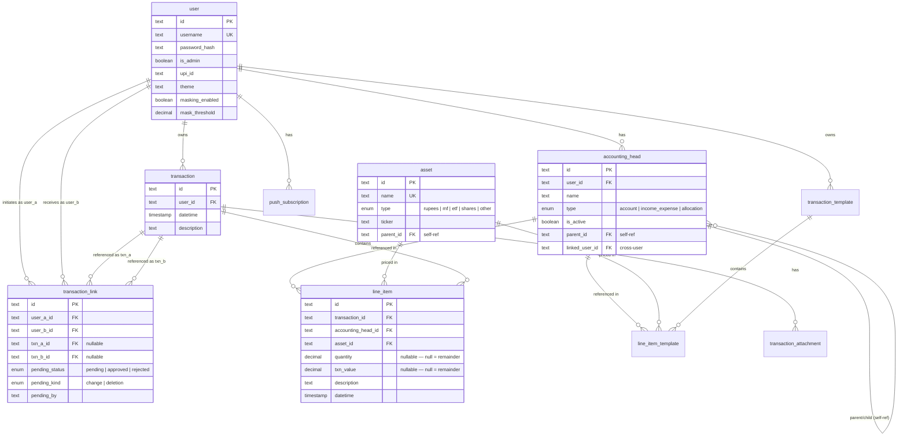
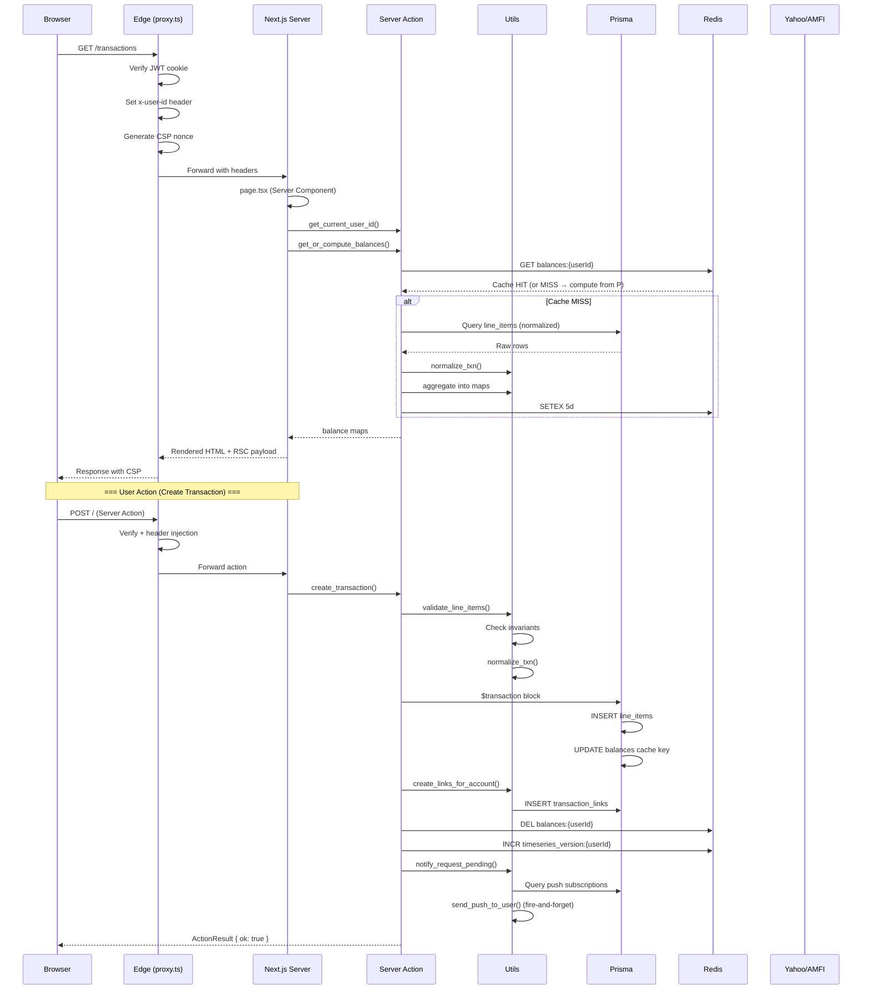
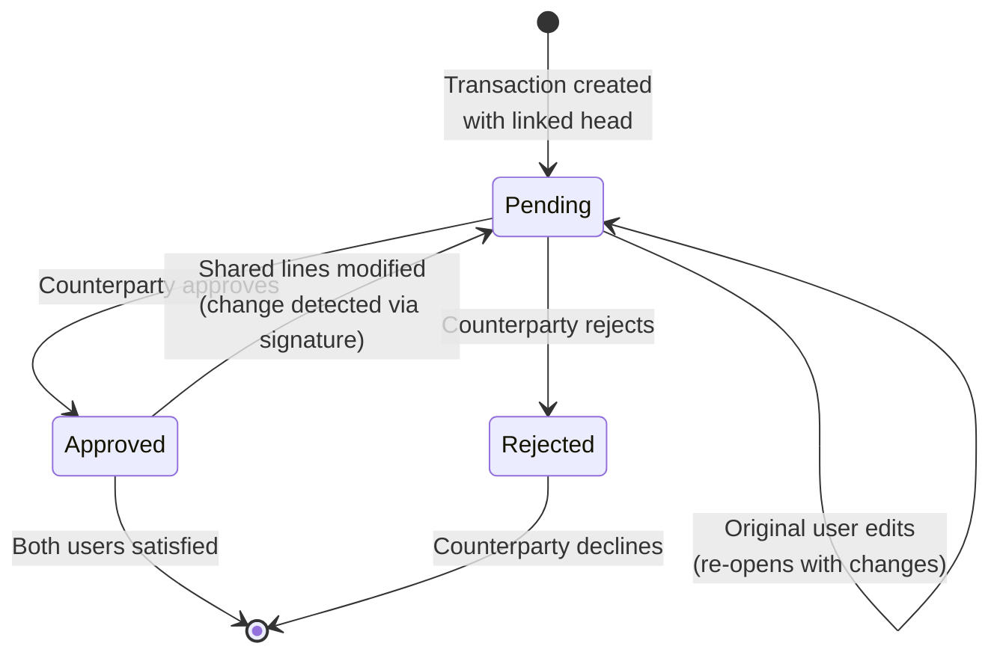

# Ledger — Architecture Diagrams

## System Architecture

```mermaid
graph TB
    subgraph Edge["Edge — proxy.ts (Vercel)"]
        JWT[JWT Verification<br/>jose + HTTP-only cookie]
        CSP[Content-Security-Policy<br/>Per-request nonce]
        REV[Session Revocation<br/>Redis auth:revoke_before]
        HDR[x-user-id / x-username<br/>Header Injection]
    end

    subgraph Next["Next.js 16 App Router"]
        direction TB
        P1[page.tsx<br/>Server Component<br/>Data fetching only]
        P2[ClientPage.tsx<br/>UI / State / Interactivity]
        SA[Server Actions<br/>app/_actions/*]
        API[API Routes<br/>app/api/*]
    end

    subgraph Utils["Domain Logic — app/_utils"]
        NT[normalize_txn.ts<br/>Null-remainder fill]
        VL[validate_line_items.ts<br/>Invariant checks]
        LK[links.ts<br/>Cross-user approvals]
        HV[head_value.ts<br/>Balance valuation]
        FF[fifo.ts<br/>FIFO lot tracking]
        PF[price_fetcher.ts<br/>Market prices / AMFI NAV]
        VT[value_timeseries.ts<br/>Chart data + caching]
        XR[xirr_calculator.js<br/>Newton-Raphson XIRR]
    end

    subgraph Lib["Library — lib/"]
        PR[prisma.ts<br/>Singleton + $extends profiling]
        RD[redis.ts<br/>Instrumented ioredis]
        EN[env.ts<br/>Zod-validated env]
        RL[rate_limit.ts<br/>Fixed-window limiter]
        MP[metrics/profile.ts<br/>AsyncLocalStorage timing]
    end

    subgraph Data["Data Layer"]
        PG[Postgres 17 / Neon<br/>Prisma 7 ORM]
        RS[Redis 8<br/>Balances / Timeseries / Sessions]
        BL[Vercel Blob<br/>Attachments / Private files]
    end

    subgraph External["External"]
        YF[Yahoo Finance<br/>ETF / Share prices]
        AM[AMFI India<br/>Mutual Fund NAV]
    end

    JWT --> P1
    JWT --> API
    JWT --> SA
    HDR --> P1
    HDR --> SA

    P1 --> P2

    SA --> NT
    SA --> VL
    SA --> LK
    SA --> HV
    SA --> FF
    SA --> PF
    SA --> VT

    SA --> PR
    SA --> RD
    SA --> RL
    SA --> MP

    PR --> PG
    RD --> RS
    PF --> YF
    PF --> AM
    API --> BL
```

---

## Database Schema (Entity-Relationship)

---

## Request Lifecycle

---

## The Null-Remainder Pattern

```mermaid
flowchart LR
    subgraph Input["Raw Line Items (stored)"]
        A1["account: bank<br/>qty=100, val=1000"]
        A2["account: wallet<br/>qty=-50, val=-500"]
        IE1["income_expense: salary<br/>qty=null, val=null"]
        AL1["allocation: savings<br/>qty=null, val=null"]
    end

    subgraph Normalize["normalize_txn()"]
        N1["account sum = 50"]
        N2["IE group: null → 50"]
        N3["AL group: null → 50"]
    end

    subgraph Output["Normalized (computed)"]
        O1["bank: qty=100"]
        O2["wallet: qty=-50"]
        O3["salary: qty=50"]
        O4["savings: qty=50"]
    end

    subgraph Invariant["Invariant"]
        I1["sum(account qty) = 50"]
        I2["sum(IE qty) = 50"]
        I3["sum(allocation qty) = 50"]
    end

    Input --> Normalize
    Normalize --> Output
    Output --> Invariant
```

---

## Cross-User Approval Workflow

---

## Key Color Legend

| Color              | Meaning                  |
| ------------------ | ------------------------ |
| `#e1f5fe` (blue)   | Edge / Middleware layer  |
| `#f3e5f5` (purple) | Next.js App Router       |
| `#e8f5e9` (green)  | Domain logic / utilities |
| `#fff3e0` (orange) | Library / infra          |
| `#ffebee` (red)    | Data stores              |
| `#e8eaf6` (indigo) | External services        |

---

_Generated for Obsidian — render `.md` files with Mermaid enabled._
